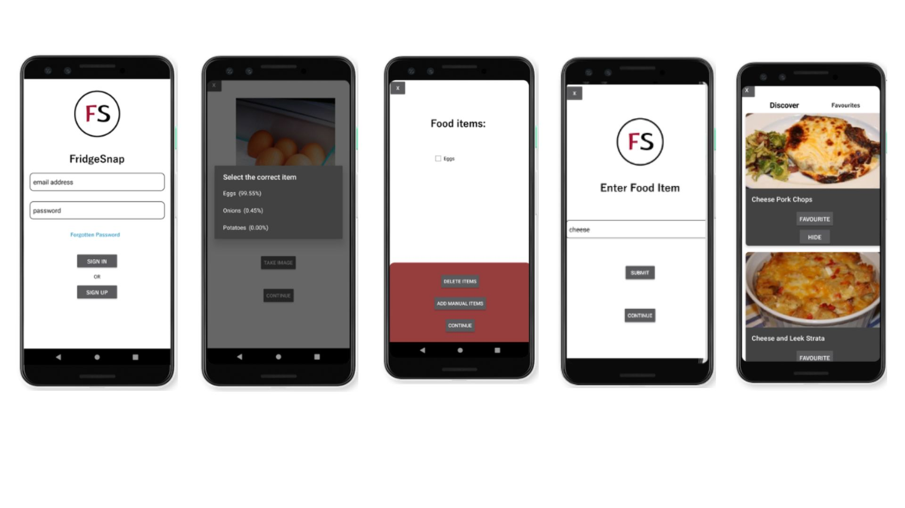

# FridgeSnap
An image-classification Android application developed to generate recipes from user-taken images of food items.

# About the Project

FridgeSnap has been developed to assist with the reduction of global food waste. FridgeSnap uses image classification and machine learning technologies to generate recipes from user-taken images of singular food items. The application currently works on Android devices. The applicaiton was developed within the AndroidStudio IDE, using Java and XML for the development of the back-end and the front-end of the app respectively, and Python was used to develop the image classification model that sits behind the application. Example screens of the application can be seen below: 

# Built with:

FridgeSnap has been built using the following frameworks and languages: 

<ul> 
  <li>Java</li>
  <li>Python</li>
  <li>XML</li>
  <li>numpy</li>
  <li>pandas</li>
  <li>tensorflow</li>
 </ul>
 
# Usage:

To install and use FridgeSnap, you can either download the .APK file to your Android device from this repository, or install the code files to an IDE, such as AndroidStudio, and open the files using an emulator.

In order to use the application from the code files - download the code files and the model file from this link: . Insert the .tflite file into the assets folder of the application. This will allow the application to use the developed model.

Alternatively, you can install the application using the .APK file to any Android device. To install this file, download the .zip folder and extract the contents. 

Once the application is opened: 

<ol>
  <li>Enter in your details by clicking 'Sign Up' - to skip this process, enter the '@' character into the email address box on the landing page to go straight to the image aspect of the application</li>
  <li>Once on the image page, click 'Take image' and take an image of any food item, this will display a prediction list of the top three predictions, select the correct item</li>
  <li>After you have taken an image of all desired items, press Continue, the next screen shows a list of all items entered so far. You are able to delete any items in the list by selecting the relevant checkbox and clicking 'Delete items'. </li>
  <li>To add an item manually, click 'Add manual items', enter the name of an item, then click 'Submit' followed by 'Continue'</li>
  <li>Once you have all items added to the general food item list, click 'Continue', this will perform a search for recipes that use the items</li>
  <li>On the discover screen you have the option to (1) favourite recipes by clicking the 'Favourite' button on any recipe card, (2) hide recipes by clicking 'Hide' on any recipe card, (3) view recipes by clciking anywhere on a recipe card.</li>
  <li>To exit the application and sign out at any time, click the 'X' button at the top left of many screens within the app</li>
  </ol>
  
  
# Video demonstration:

A video demonstration of the application can be seen on the following link: <a href=https://youtu.be/YhYpCkvr_So>Video demonstration</a>
  
# License:
Distributed under the MIT License

# Contact:

Name: Liam Boyd  
Email: liam_boyd2@outlook.com  
LinkedIn: <a href=https://www.linkedin.com/in/liam-boyd-7b4463214>https://www.linkedin.com/in/liam-boyd-7b4463214/</a>

# Acknowledgments:

FridgeSnap has been completed as my final year research project as part of a BSc Software Engineering degree at Edge Hill University, Ormskirk, United Kingdom. This project has been supervised by Dr Nonso Nnamoko, whose help has been invaluable throughout all aspects of the project. Special thanks to the Department of Computer Science at Edge Hill University for providing me with the resources to carry out full development of the machine learning model that sits behind the application. 

